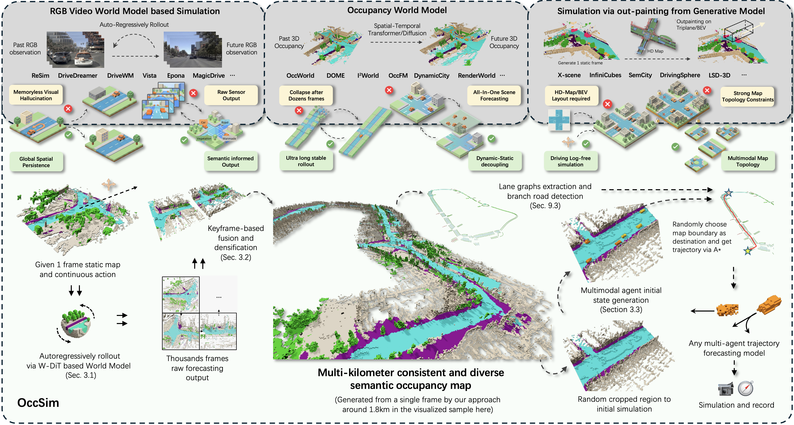

# OccSim: Multi-kilometer Simulation with Long-horizon Occupancy World Models

<br>

<p align="center">
  <strong>Submission Under Review</strong>
</p>

<p align="center">
  <a target="_blank">Tianran Liu</a>&nbsp;&nbsp;&nbsp;
  <a target="_blank">Shengwen Zhao</a>&nbsp;&nbsp;&nbsp;
  <a target="_blank">Mozhgan Pourkeshavarz</a>&nbsp;&nbsp;&nbsp;
  <a target="_blank">Weican Li</a>&nbsp;&nbsp;&nbsp;
  <a href="https://leaf.utias.utoronto.ca/author/nicholas-rhinehart/" target="_blank">Nicholas Rhinehart</a>
    
  <br />
  Learning, Embodied Autonomy, and Forecasting (LEAF) Lab, University of Toronto
</p>

<p align="center">
  <a href="https://arxiv.org/abs/2603.28887"></a>
  &nbsp;&nbsp;&nbsp;
  <a href="https://github.com/Orbis36/OccSim"></a>
  &nbsp;&nbsp;&nbsp;
  <a href="https://github.com/Orbis36/OccSim"></a>
</p>

<br clear="all">

<p align="center">
  
</p>

---

## 📢 News
* **[Upcoming]** The source code, pre-trained models, and generation pipelines will be officially released upon the paper's acceptance. Stay tuned!

## 🚀 Overview
**OccSim** is the first occupancy world model-driven simulation via autoregressive rollouts. By eliminating the reliance on labeled HD maps during simulation, OccSim enables scalable autonomous driving simulation and achieves multi-kilometer, long-horizon generation with SoTA fidelity and diversity.

> **Note:** We are currently organizing the codebase. Please check back later for the full release!

## 🔗 Citation
If you find our work interesting or helpful, please consider citing:

```bibtex
@article{liu2026occsim,
  title={OccSim: Multi-kilometer Simulation with Long-horizon Occupancy World Models},
  author={Liu, Tianran and Zhao, Shengwen and Pourkeshavarz, Mozhgan and Li, Weican and Rhinehart, Nicholas},
  journal={arXiv preprint arXiv:2603.28887},
  year={2026}
}