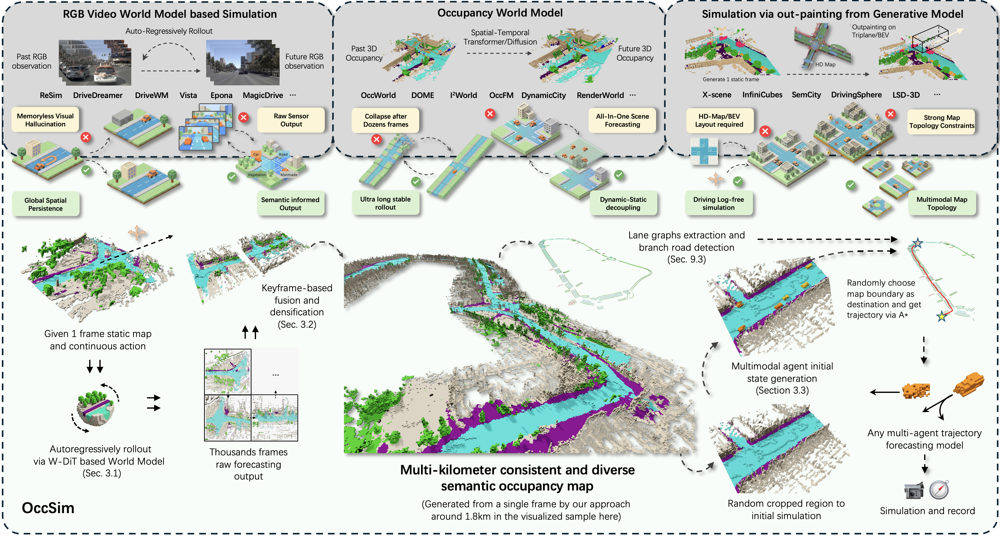

# OccSim: Multi-kilometer Simulation with Long-horizon Occupancy World Models

<br>

<p align="center">
  <strong>Anonymous authors</strong>
  <br />
  Paper under double-blind review
</p>

<br clear="all">

<p align="center">
  
</p>

---

## 📢 News
* **[Upcoming]** The source code, pre-trained models, and generation pipelines will be officially released upon the paper's acceptance. Stay tuned!

## 🚀 Overview
**OccSim** is the first occupancy world model-driven simulation via autoregressive rollouts. By eliminating the reliance on labeled HD maps during simulation, OccSim enables scalable autonomous driving simulation and achieves multi-kilometer, long-horizon generation with SoTA fidelity and diversity.

> **Note:** We are currently organizing the codebase. Please check back later for the full release!

## 🔗 Citation
If you find our work interesting or helpful, please consider citing:

```bibtex
@article{anonymous2026occsim,
  title={OccSim: Multi-kilometer Simulation with Long-horizon Occupancy World Models},
  author={Anonymous},
  journal={Under double-blind review},
  year={2026}
}